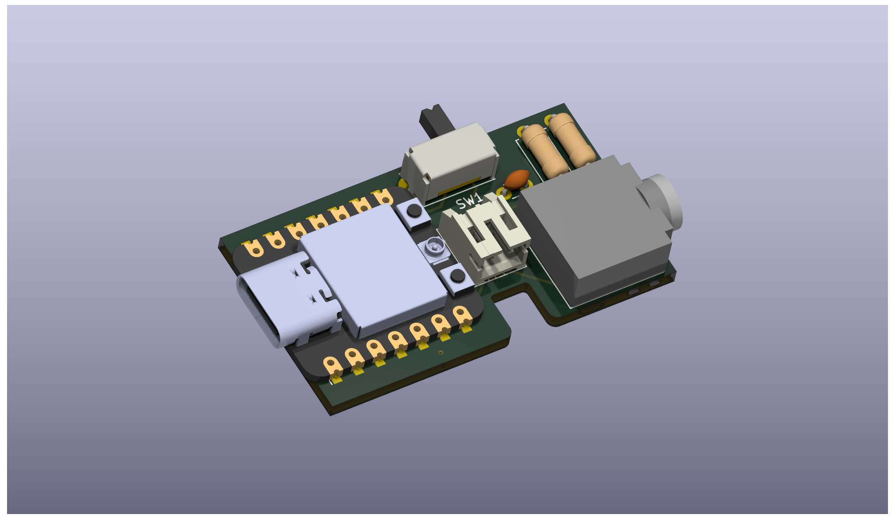
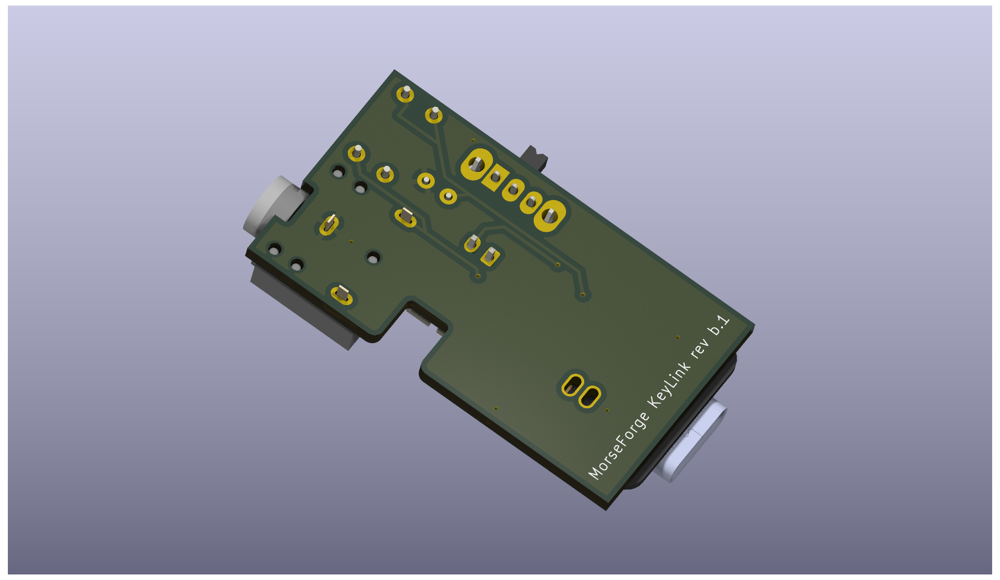

# MorseForge Keylink

**Keylink** is an open‑source hardware adapter that makes traditional Morse keys Bluetooth‑capable.

It is designed and maintained by the **MorseForge developer** as a companion device for upcoming external‑key features in the **MorseForge** app.

🌐 **MorseForge:** https://morseforge.com

---

## What is Keylink?

Keylink bridges classic Morse key hardware with modern Bluetooth‑enabled devices. It allows straight keys, paddles, and other traditional Morse inputs to transmit key events wirelessly using Bluetooth Low Energy (BLE).

Keylink is intended to:
- Enable wireless Morse key input
- Integrate directly with future MorseForge app features
- Remain compact, battery‑powered, and easy to assemble
- Be fully open source and community‑friendly

Unlike generic microcontroller dev boards, Keylink is a **purpose‑built Morse interface**.

---

## Hardware Overview — Rev B

The current hardware revision (Rev B) includes:

- **ESP32‑C3 microcontroller (Seeed XIAO form factor)**
- **3.5 mm stereo jack (SJ1‑3523N)** for Morse key input
- **Slide power switch** for battery isolation
- **JST‑PH 2.0 mm battery connector**
- LiPo battery support
- Passive input conditioning network

This revision has been fabricated via OSH Park and is undergoing validation.

---

## PCB Renders (Rev B)

### Top View


### Bottom View


> Renders generated from KiCad’s 3D viewer. These are not production photographs.

---

## Repository Structure

```
hardware/
├── keylink_revB/     # KiCad schematic + PCB layout
├── gerber/           # Manufacturing Gerbers
```

Additional firmware and software directories will be added as development progresses.

---

## Firmware & App Integration

Firmware for the ESP32‑C3 and BLE integration with MorseForge is planned and will live in this repository.

The long‑term goal is seamless pairing between Keylink and the MorseForge mobile app, enabling:
- External key input
- Practice and training modes
- Real‑time Morse decoding and feedback

---

## Open Source

This project is released as open‑source hardware and software.

Licensing details will be finalized and documented explicitly, but the intent is:
- **Permissive open hardware**
- **Permissive firmware licensing**
- Community contributions welcome

---

## Disclaimer

This is experimental hardware.

No warranties are provided.  
Use at your own risk.

---

## Author

Keylink is designed and maintained by the **MorseForge developer** as part of the broader MorseForge ecosystem.

🌐 https://morseforge.com
